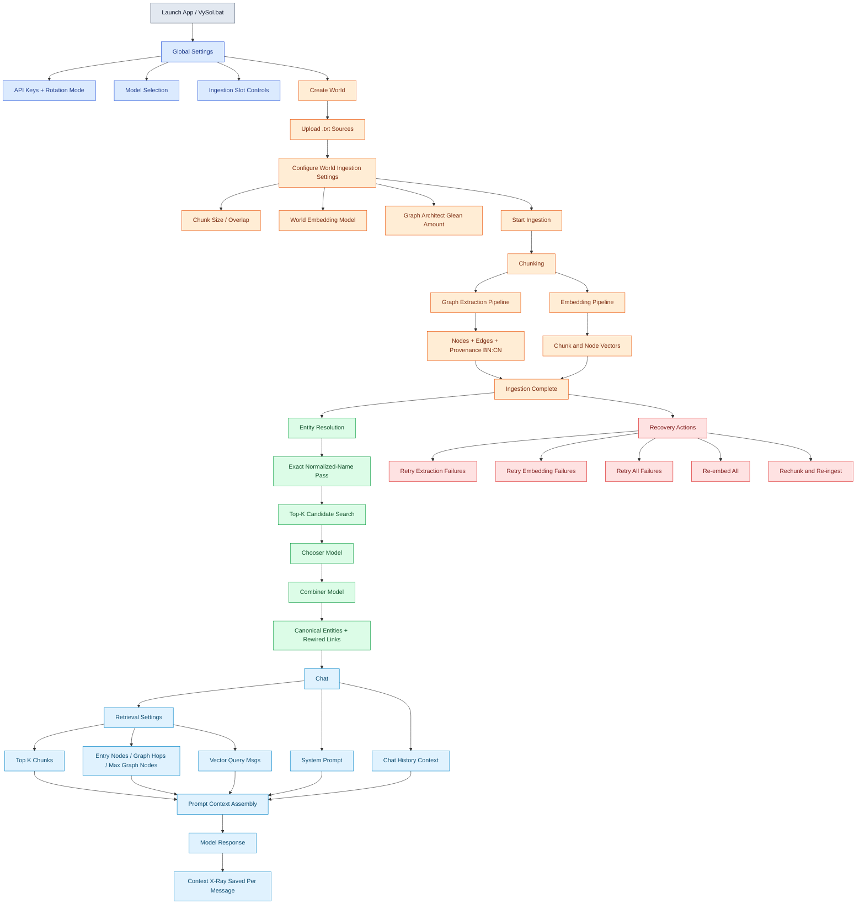

# System Diagram

This diagram is intentionally kept in its own file so it can grow over time as the app architecture expands.

```mermaid
flowchart TD
  A[Launch App / VySol.bat] --> B[Global Settings]
  B --> B1[API Keys + Rotation Mode]
  B --> B2[Model Selection]
  B --> B3[Ingestion Slot Controls]

  B --> C[Create World]
  C --> C1[Upload .txt Sources]
  C1 --> D[Configure World Ingestion Settings]
  D --> D1[Chunk Size / Overlap]
  D --> D2[World Embedding Model]
  D --> D3[Graph Architect Glean Amount]

  D --> E[Start Ingestion]
  E --> F[Chunking]
  F --> G[Graph Extraction Pipeline]
  F --> H[Embedding Pipeline]
  G --> G1[Nodes + Edges + Provenance BN:CN]
  H --> H1[Chunk and Node Vectors]
  G1 --> I[Ingestion Complete]
  H1 --> I

  I --> J[Entity Resolution]
  J --> J1[Exact Normalized-Name Pass]
  J1 --> J2[Top-K Candidate Search]
  J2 --> J3[Chooser Model]
  J3 --> J4[Combiner Model]
  J4 --> J5[Canonical Entities + Rewired Links]

  J5 --> K[Chat]

  K --> KR[Retrieval Settings]
  KR --> KR1[Top K Chunks]
  KR --> KR2[Entry Nodes / Graph Hops / Max Graph Nodes]
  KR --> KR3[Vector Query Msgs]

  K --> PS[System Prompt]
  K --> CH[Chat History Context]

  KR1 --> L[Prompt Context Assembly]
  KR2 --> L
  KR3 --> L
  PS --> L
  CH --> L

  L --> M[Model Response]
  M --> N[Context X-Ray Saved Per Message]

  I --> R[Recovery Actions]
  R --> R1[Retry Extraction Failures]
  R --> R2[Retry Embedding Failures]
  R --> R3[Retry All Failures]
  R --> R4[Re-embed All]
  R --> R5[Rechunk and Re-ingest]

  classDef launch fill:#e2e8f0,stroke:#475569,color:#0f172a
  classDef settings fill:#dbeafe,stroke:#1d4ed8,color:#1e3a8a
  classDef ingestion fill:#ffedd5,stroke:#ea580c,color:#7c2d12
  classDef resolution fill:#dcfce7,stroke:#16a34a,color:#14532d
  classDef chat fill:#e0f2fe,stroke:#0284c7,color:#0c4a6e
  classDef recovery fill:#fee2e2,stroke:#dc2626,color:#7f1d1d

  class A launch
  class B,B1,B2,B3 settings
  class C,C1,D,D1,D2,D3,E,F,G,H,G1,H1,I ingestion
  class J,J1,J2,J3,J4,J5 resolution
  class K,KR,KR1,KR2,KR3,PS,CH,L,M,N chat
  class R,R1,R2,R3,R4,R5 recovery
```
